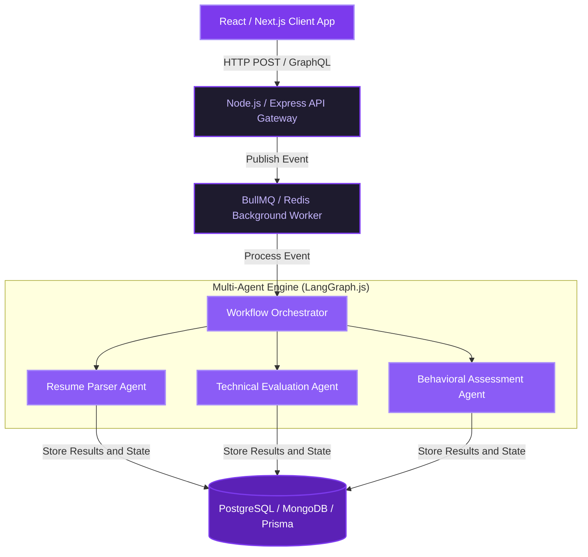

<!-- Waving Gradient Header matching the Lavender/Purple theme -->

 

<!-- Custom Typing SVG -->

 

<!-- Social badging -->

 

---

### 💜 About Me

I am a **Full Stack Software Engineer** specializing in constructing scalable backend architectures and designing interactive frontends. My engineering philosophy revolves around Clean Code, SOLID Principles, and architectural design patterns.

- 🔭 Currently building **[Fusion Store](https://github.com/MarwaAshraf1812/fusion-store)** — a high-performance Next.js 16 e-commerce engine.
- 🌱 Deepening expertise in **System Architectures**, **NestJS**, and **Next.js Server Actions**.
- 🏛️ Engineering Fellow at **ITI (Information Technology Institute)**.
- 🏆 ALX Software Engineering Graduate — specialized in Backend Systems.
- 📍 Based in **Egypt**

 

---

### 🏛️ Engineering Blueprint & System Flow
Below is a technical architecture diagram representing the asynchronous workflow I implement in multi-agent processing systems (such as my recruitment platform **Naqla AI**):

---

### 🛠️ Tech Stack & Tooling

<table>
  <tr>
    <td valign="top" width="50%">
      <h4>⚡ Backend & APIs</h4>
      
      
      
      
      
      
      
    </td>
    <td valign="top" width="50%">
      <h4>🎨 Frontend & Styling</h4>
      
      
      
      
      
      
      
    </td>
  </tr>
  <tr>
    <td valign="top" width="50%">
      <h4>💾 Databases & ORMs</h4>
      
      
      
      
      
    </td>
    <td valign="top" width="50%">
      <h4>🐳 DevOps & Architecture</h4>
      
      
      
      
      
      
    </td>
  </tr>
</table>

---

### 💜 Featured Projects

<table width="100%">
  <tr>
    <td width="50%" valign="top">
      <h3>🛍️ Fusion Store</h3>
      
A premium e-commerce platform built with Next.js 16 App Router. Features include a dynamic product customizer studio, real-time drop countdowns, stripe checkout, and role-based stock protection rules.

      

        
        
        
      

      <a href="https://github.com/MarwaAshraf1812/fusion-store">View Code →</a>
    </td>
    <td width="50%" valign="top">
      <h3>🤖 Naqla AI</h3>
      
A multi-agent recruitment platform leveraging LLM workflows. It parses applications, evaluates technical answers, profiles candidates, and scores applicants asynchronously through a 5-stage pipeline.

      

        
        
        
      

      <a href="https://github.com/MarwaAshraf1812">View Code →</a>
    </td>
  </tr>
  <tr>
    <td width="50%" valign="top">
      <h3>🕌 Noor</h3>
      
A gamified Quran memorization tracker for kids, including custom goal dashboards, rewards/gem systems, interactive quizzes, and visual progress maps.

      

        
        
        
      

      <a href="https://github.com/MarwaAshraf1812">View Code →</a>
    </td>
    <td width="50%" valign="top">
      <h3>💼 Workshop Management System</h3>
      
A secure server administration API to organize software workshops, assign homework tasks, host automated quizzes, and calculate real-time student leaderboards.

      

        
        
        
      

      <a href="https://github.com/MarwaAshraf1812">View Code →</a>
    </td>
  </tr>
</table>

---

### 📊 GitHub Dashboard

  <table border="0" cellpadding="0" cellspacing="0">
    <tr>
      <td>
        
      </td>
      <td>
        
      </td>
    </tr>
    <tr>
      <td colspan="2" align="center">
        
      </td>
    </tr>
  </table>

---

*"Code with intention, build with love."* 💜

